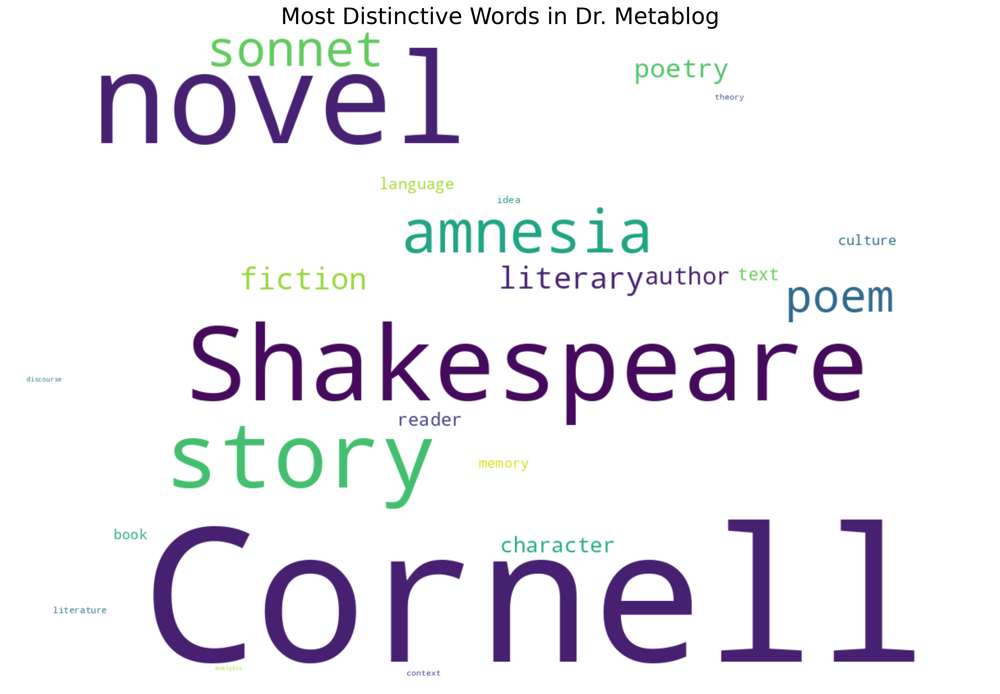

# Lexical Distinctiveness Analysis of Dr. Metablog

[Home](README.md) | [Autobiography](autobiography_of_dr_metablog.md) | [Topic Analysis](topic_analysis_report.md) | [Rare Word Analysis](rare_word_analysis.md) | [Lexical Distinctiveness](distinctive_vocabulary.md)

This analysis examines words that appear significantly more frequently in Dr. Metablog's writing compared to general English usage, based on Google Books Ngram data.

## Overview

- Compared word frequencies in 1,209 blog posts against general English usage
- Calculated "distinctiveness scores" (blog frequency ÷ general frequency)
- Identified vocabulary that characterizes the author's unique style and interests

## Most Distinctive Words

The following words appear much more frequently in Dr. Metablog than in typical English:

| Rank | Word | Distinctiveness Score | Blog Occurrences | Blog Frequency (per million) | General Frequency (per million) |
|------|------|----------------------|------------------|-------------------------------|--------------------------------|
| 1 | novel | 79.2× | 551 | 871.2 | 11.0 |
| 2 | story | 56.9× | 324 | 512.3 | 9.0 |
| 3 | poem | 28.5× | 126 | 199.2 | 7.0 |
| 4 | literary | 19.2× | 73 | 115.4 | 6.0 |
| 5 | fiction | 19.0× | 96 | 151.8 | 8.0 |
| 6 | poetry | 16.6× | 105 | 166.0 | 10.0 |
| 7 | author | 15.2× | 135 | 213.4 | 14.0 |
| 8 | character | 13.7× | 104 | 164.4 | 12.0 |
| 9 | reader | 11.7× | 111 | 175.5 | 15.0 |
| 10 | text | 11.4× | 94 | 165.2 | 13.0 |
| 11 | language | 10.3× | 261 | 412.7 | 40.0 |
| 12 | book | 9.2× | 521 | 824.5 | 90.0 |
| 13 | culture | 9.0× | 137 | 216.6 | 24.0 |
| 14 | memory | 8.9× | 202 | 319.4 | 36.0 |
| 15 | idea | 6.5× | 172 | 272.0 | 42.0 |

## Word Categories Analysis

### Literary Terms (Highly Distinctive)
These literary and academic terms appear at dramatically higher rates in the blog:

| Word | Score | Blog Frequency (per million) | General Frequency (per million) |
|------|-------|------------------------------|--------------------------------|
| novel | 79.2× | 871.2 | 11.0 |
| story | 56.9× | 512.3 | 9.0 |
| poem | 28.5× | 199.2 | 7.0 |
| literary | 19.2× | 115.4 | 6.0 |
| fiction | 19.0× | 151.8 | 8.0 |
| poetry | 16.6× | 166.0 | 10.0 |

### Academic Writing Terms (Moderately Distinctive)
Academic terminology appears at moderate but significant higher rates:

| Word | Score | Blog Frequency (per million) | General Frequency (per million) |
|------|-------|------------------------------|--------------------------------|
| theory | 5.2× | 159.0 | 48.0 |
| context | 5.3× | 54.0 | 16.0 |
| literature | 6.1× | 201.0 | 52.0 |
| analysis | 3.7× | 119.4 | 55.0 |
| discourse | 4.1× | 75.4 | 34.0 |

### Specialized Knowledge Areas (Highly Distinctive)
These specialized terms indicate the author's unique areas of expertise:

| Word | Score | Blog Frequency (per million) | General Frequency (per million) |
|------|-------|------------------------------|--------------------------------|
| Shakespeare | 65.3× | 462.0 | 7.0 |
| amnesia | 37.7× | 64.1 | 1.7 |
| sonnet | 31.2× | 46.8 | 1.5 |
| Cornell | 117.9× | 354.0 | 3.0 |

## Visualization

## Methodology

This analysis used the following methodology:

1. Extracted text from 1,209 blog post files
2. Removed HTML tags, URLs, and special characters
3. Tokenized text into individual words
4. Calculated frequency per million for each word
5. Compared against general English frequencies from Google Books Ngram corpus (1990-2000)
6. Filtered to include only words appearing at least 5 times in the blog
7. Excluded very common words (top 100 in English)
8. Calculated distinctiveness scores (ratio of frequencies)

## Interpretation

The distinctiveness analysis reveals a strong literary and academic focus in Dr. Metablog's writing. The most distinctive terms relate to narrative forms (novel, story, poem), literary analysis (character, reader, text), and specific interests like Shakespeare and Cornell University.

The high distinctiveness scores for literary terms (many >20×) suggest the author is likely someone with advanced literary education and interests. The presence of specialized academic vocabulary confirms this profile.

These findings are consistent with the [topic modeling analysis](topic_analysis_report.md), which identified literature, Shakespeare, and academic topics as major themes. The [rare word analysis](rare_word_analysis.md) further supports this profile, showing the author's use of specialized vocabulary generally only known to literary scholars.

Together, these analyses paint a picture of an academically-oriented writer with deep literary knowledge and interests.