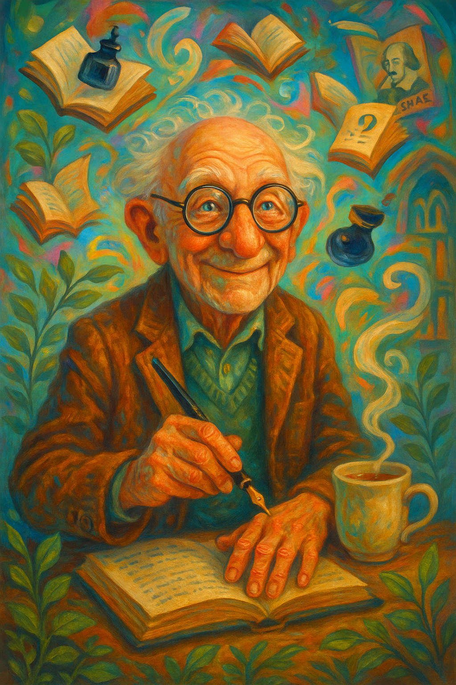

# Portrait of Dr. Metablog

## Table of Contents
| Section | Description |
|---------|-------------|
| [Home](README.md) | Project home |
| [Autobiography](autobiography_of_dr_metablog.md) | Dr. Metablog's memoir |
| [Portrait](portrait_of_dr_metablog.md) | Visual representation |
| [Topic Analysis](topic_analysis_report.md) | LDA topic modeling |
| [Rare Word Analysis](rare_word_analysis.md) | Unusual vocabulary |
| [Lexical Distinctiveness](distinctive_vocabulary.md) | Comparative language usage |

## Vivian de St. Vrain: A Literary Portrait

Based on his writings, blog posts, and autobiographical details, this portrait envisions Dr. Metablog as he might appear - a distinguished scholar with Brooklyn roots, Cornell education, and a lifetime of literary engagement.

  
  
Portrait of Vivian de St. Vrain based on his literary presence

## The Man Behind the Blog

This portrait attempts to capture the essence of Vivian de St. Vrain (Dr. Metablog), now in his mid-80s, a man whose life has been shaped by literature, particularly Shakespeare, and academic pursuits. As described in his [autobiography](autobiography_of_dr_metablog.md), he grew up in Brooklyn in the 1940s, graduated from Cornell in 1960, and has maintained a lifelong love affair with books.

### Characteristics Reflected in the Portrait:

- **Thoughtful expression**: Capturing his introspective and analytical nature
- **Academic demeanor**: Reflecting his life as a professor of English literature
- **Hint of humor**: Suggesting his self-deprecating wit and ironic perspective
- **Books nearby**: Representing his lifelong companionship with literature
- **Dignified but unpretentious**: Matching his literary voice which balances erudition with accessibility
- **Casual attire**: Consistent with his preference for comfort over formality in his later years

Dr. Metablog describes himself as directionally challenged but intellectually curious, more comfortable with books than with technology, and increasingly reflective as he approaches his ninth decade. The portrait aims to capture this intellectual vitality coupled with the physical signs of aging that he references with good humor in his writing.

## The Visual Interpretation

Creating a portrait of someone known only through their words presents a unique challenge. This rendering is not meant to be definitive but rather an artistic interpretation that captures the spirit of Dr. Metablog as revealed in his writings - a literary scholar with Brooklyn roots, wry humor, and a lifetime of reading and teaching.

  Posted by Vivian de St. Vrain at 9:15 AM | Portraits | Cornell Memories | Academic Life | Permalink

