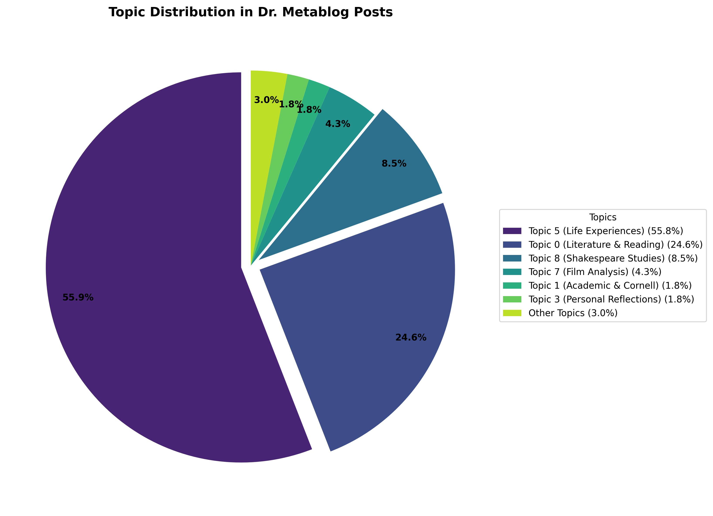

# Topic Analysis of Dr. Metablog Posts

[Home](README.md) | [Autobiography](autobiography_of_dr_metablog.md) | [Topic Analysis](topic_analysis_report.md) | [Rare Word Analysis](rare_word_analysis.md) | [Lexical Distinctiveness](distinctive_vocabulary.md)

This report presents the results of topic modeling performed on the Dr. Metablog blog corpus using Latent Dirichlet Allocation (LDA).

## Overview

- Analyzed 1,209 blog posts using LDA with 15 topics
- Extracted key topics and their representative words
- Identified major themes and their distribution across the corpus

## Topic Model Results

The LDA model identified 15 distinct topics in the blog posts:

| Topic | Key Words | Interpretation |
|-------|-----------|----------------|
| 0 | novel, read, old, just, like, love, good, time, man, story | Literature & Reading |
| 1 | quot, english, cornell, writes, february, vivian, just, book, january, read | Academic & Cornell |
| 2 | peace, years, dark, did, going, political, introduction, later, people, unknown | Political Commentary |
| 3 | quot, life, october, permalink, december, february, poop, autobiography, jews, jewish | Personal Reflections |
| 4 | dog, cart, dogs, ball, horse, vehicle, fly, nineteenth, century, just | Animals & Historical |
| 5 | years, know, just, ve, don, did, new, like, life, time | Life Experiences |
| 6 | antres, vast, othello, idle, heads, house, desdemona, touch, men, eat | Shakespeare's Othello |
| 7 | film, amnesia, movie, memory, films, played, pearlman, plot, movies, murder | Film Analysis |
| 8 | shakespeare, word, words, play, language, say, english, like, just, king | Shakespeare Studies |
| 9 | universe, joint, stars, billion, numbers, rocks, dark, life, big, years | Astronomy & Science |
| 10 | america, states, government, president, united, obama, trump, slavery, possibly, starokonstantinov | American Politics |
| 11 | seat, sign, cost, class, travel, air, billion, extra, free, business | Travel Experiences |
| 12 | duke, earl, rug, unknown, song, lord, lyric, row, stop, world | Poetry & Music |
| 13 | poem, marlowe, radio, lord, poet, grass, days, poems, thy, poetry | Poetry Analysis |
| 14 | bats, bat, eat, hour, brown, calls, little, hear, minute, produce | Nature Observations |

## Topic Distribution

Distribution of topics across the corpus:

| Topic | Documents | Percentage |
|-------|-----------|------------|
| 5 (Life Experiences) | 675 | 55.8% |
| 0 (Literature & Reading) | 298 | 24.6% |
| 8 (Shakespeare Studies) | 103 | 8.5% |
| 7 (Film Analysis) | 52 | 4.3% |
| 1 (Academic & Cornell) | 22 | 1.8% |
| 3 (Personal Reflections) | 22 | 1.8% |
| 10 (American Politics) | 11 | 0.9% |
| 4 (Animals & Historical) | 9 | 0.7% |
| 13 (Poetry Analysis) | 6 | 0.5% |
| 9 (Astronomy & Science) | 4 | 0.3% |
| 6 (Shakespeare's Othello) | 3 | 0.2% |
| 12 (Poetry & Music) | 2 | 0.2% |
| 11 (Travel Experiences) | 1 | 0.1% |
| 14 (Nature Observations) | 1 | 0.1% |

## Key Insights

1. **Personal and Reflective Content Dominates**: Topic 5 (Life Experiences) represents over half of all content, suggesting the blog is largely personal and reflective in nature.

2. **Strong Literary Focus**: Topics 0, 8, and 13 combined account for 33.6% of the content, showing a significant emphasis on literature, reading, and poetry.

3. **Shakespeare Specialization**: The presence of both a general Shakespeare topic (8) and a specific Othello topic (6) indicates deep engagement with Shakespearean works.

4. **Academic Background**: Topic 1 reveals connections to Cornell University and academic English studies.

5. **Film Interest with Memory Theme**: Topic 7 specifically includes "amnesia" and "memory" alongside film terms, suggesting a specific interest in films dealing with memory.

6. **Breadth of Interests**: Despite clear concentrations, the topics span literature, politics, science, travel, and nature, indicating broad intellectual interests.

## Visualization

## Methodology

This analysis used Latent Dirichlet Allocation (LDA) with the following parameters:

- Number of topics: 15
- Max iterations: 10
- Learning method: Online
- Year range for analysis: 1990-2000 (for comparison with Google Ngram data)
- Text preprocessing included HTML removal, URL removal, and stopword filtering

## Conclusion

The topic modeling analysis reveals Dr. Metablog as primarily a personal and literary blog with significant academic influences. The author shows deep knowledge of literature, particularly Shakespeare, while also engaging with contemporary issues in politics, film, and science. The prevalence of personal experience topics suggests the blog serves as both an intellectual platform and a personal journal.

These findings align with and complement the [lexical distinctiveness analysis](distinctive_vocabulary.md) and [rare word analysis](rare_word_analysis.md), which similarly identified literature and academic language as defining characteristics of the blog.